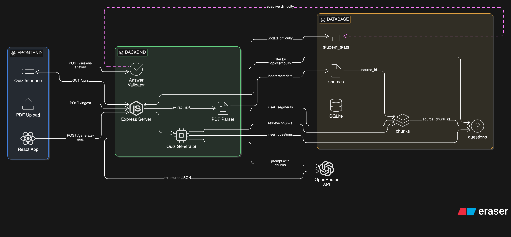

# 🧠 Peblo AI — Adaptive Quiz Backend

An intelligent backend that ingests educational PDFs, generates adaptive quizzes using AI (OpenRouter), and tracks student performance to adjust difficulty dynamically.

---

## 📁 Architecture

```
src/
├── index.ts                 # Express server entry point
├── types/
│   └── pdf-parse.d.ts       # Custom type declarations for pdf-parse v2
├── db/
│   ├── schema.ts            # Drizzle ORM schema (sources, chunks, questions, student_stats)
│   └── index.ts             # Database client initialization (WAL mode)
├── routes/
│   ├── ingest.ts            # POST /ingest
│   ├── quiz.ts              # POST /quiz/generate, GET /quiz
│   └── answer.ts            # POST /submit-answer
├── controllers/
│   ├── ingestController.ts  # PDF parsing + chunking + storage
│   ├── quizController.ts    # Quiz generation via OpenRouter + retrieval
│   └── answerController.ts  # Answer validation + adaptive stats
└── services/
    ├── pdfService.ts        # pdf-parse extraction + overlapping chunking
    ├── openRouterService.ts # OpenRouter API with structured prompts
    └── quizService.ts       # DB queries with topic/difficulty filters

client/                      # React frontend (Vite + Tailwind CSS v4)
├── src/
│   ├── services/api.ts      # Centralized API service layer
│   ├── hooks/useQuiz.ts     # Custom hook for quiz state management
│   ├── components/          # Reusable UI components (Header, StatCard, TabBtn, AnswerBtn)
│   └── pages/               # Page components (Upload, Generate, Quiz, QuizComplete)
└── vite.config.ts           # Vite config with Tailwind + API proxy to backend
```

---

## ⚙️ Prerequisites

- **Node.js** ≥ 18
- **npm** ≥ 9
- An **OpenRouter API key** ([get one here](https://openrouter.ai/keys))

---

## 🚀 Installation

```bash
# 1. Clone the repository
git clone https://github.com/Ishan4705/AI-Backend-Challenge.git
cd AI-Backend-Challenge

# 2. Install dependencies (backend + frontend)
npm install
cd client && npm install && cd ..

# 3. Set up environment variables
cp .env.example .env
# Edit .env and add your OPENROUTER_API_KEY

# 4. Push database schema
npm run db:push
```

---

## 🔧 Configuration

Copy `.env.example` to `.env` and fill in:

| Variable | Description | Default |
|----------|-------------|---------|
| `PORT` | Server port | `3000` |
| `OPENROUTER_API_KEY` | Your OpenRouter API key | — |
| `OPENROUTER_MODEL` | LLM model to use | `google/gemini-2.0-flash-001` |
| `DATABASE_URL` | SQLite database path | `./peblo.db` |

---

## ▶️ Running

```bash
# Start both backend + frontend (single command)
npm run dev

# Backend only
npm run dev:server

# Frontend only
npm run dev:client

# Production build
npm run build
npm start
```

> **Backend** runs on `http://localhost:3000`  
> **Frontend** runs on `http://localhost:5173` (proxies API calls to backend)

---

## 🧠 System Workflow & Design

Peblo AI uses a robust 5-stage pipeline to guarantee diverse, high-quality, non-repetitive quiz questions.



### 1. Ingestion & Preprocessing
When a PDF is uploaded, it is parsed and chunked using a sliding window approach (e.g., 1000 characters with 200 overlap) to preserve context. Metadata like `topic`, `grade`, and `subject` are attached to the source.

### 2. Intelligent Quiz Generation Pipeline
For each chunk, the backend runs a comprehensive semantic pipeline to generate questions:

1. **🤖 LLM Generation (OpenRouter API)**
   - The chunk and topic metadata are sent to the LLM (`text-embedding-3-small` / Gemini 2.0 Flash) to generate raw questions (MCQ, True/False, Fill-in-the-Blanks).
   - An exclusion list (prompt-level dedup) prevents known duplicates.

2. **🔍 Structural Validation (`validationService`)**
   - Rules-engine verifies structure: required fields, MCQ options count (4), correct answer inclusion in options, TF answer formats, and FIB blank markers.

3. **🧬 Embedding Similarity Filter (`similarityService`)**
   - Neural network embeddings (via OpenRouter API) map questions to vectors.
   - Cosine similarity filters out questions too close to existing ones in the DB (threshold > 0.85). This effectively handles rephrased duplicates (e.g., "What is photosynthesis?" vs. "Define photosynthesis").

4. **📊 Quality Evaluation (`qualityService`)**
   - **40% Rule-Based Metric:** Evaluates question length, detailed explanations, MCQ option balance, and distracting patterns (e.g., longest option is the answer).
   - **60% LLM Metric:** Evaluates cognitive Bloom's level (recall/understand/apply/analyze), alignment to source, readability, and plausible distractors.
   - Questions below the threshold (50/100) are rejected.

5. **💾 Storage & Caching**
   - High-quality, unique questions are stored.
   - Embeddings are cached in SQLite to guarantee fast filtering for future generations (O(1) retrieval per question).
   - If a chunk generates 0 acceptable questions, the system attempts up to 3 automatic retries to prompt creativity.

### 3. Adaptive Difficulty Engine
Using real-time performance evaluation, the difficulty automatically adapts per user and topic:
- **Demotion:** Accuracy < 40% over 3 attempts lowers the difficulty level.
- **Promotion:** Accuracy ≥ 80% over 3 attempts increases difficulty level.

---

## 📡 API Endpoints

| Method | Endpoint | Description |
|--------|----------|-------------|
| `POST` | `/ingest` | Upload PDF (form-data: `pdf`, `topic`, `grade`) |
| `POST` | `/quiz/generate` | Trigger AI generation for a specific `sourceId` |
| `GET` | `/quiz` | Retrieve questions (Query params: `topic`, `difficulty`) |
| `POST` | `/submit-answer` | Submit answer and update adaptive stats |

### Example: Ingest a PDF

```bash
curl -X POST http://localhost:3000/ingest \
  -F "pdf=@./sample.pdf" \
  -F "topic=Science" \
  -F "grade=Grade 3" \
  -F "subject=Plants & Animals"
```

### Example: Generate Quiz

```bash
curl -X POST http://localhost:3000/quiz/generate \
  -H "Content-Type: application/json" \
  -d '{"sourceId": "<source-id>", "difficulty": "medium", "numQuestions": 5}'
```

### Example: Submit Answer

```bash
curl -X POST http://localhost:3000/submit-answer \
  -H "Content-Type: application/json" \
  -d '{"questionId": "<question-id>", "studentId": "student-001", "answer": "Photosynthesis"}'
```

---

## 🧩 Adaptive Logic

The system monitors student accuracy per topic, utilizing a randomly generated `studentId` (e.g., `STU_123`) created by the frontend on initial load.

- **Promotion:** If accuracy reaches ≥80% after 3+ attempts, difficulty increments.
- **Demotion:** If accuracy falls below 40% after 3+ attempts, difficulty decrements.

Difficulty levels: `easy` → `medium` → `hard`

---

## 🗄️ Database Schema

| Table | Purpose |
|-------|---------|
| `sources` | Uploaded PDFs with metadata (filename, topic, grade, subject) |
| `chunks` | Text chunks from PDFs (1000 chars, 200 overlap) linked to sources |
| `questions` | Generated quiz questions (MCQ, TF, FIB) linked to chunks |
| `student_stats` | Per-student accuracy and adaptive difficulty tracking |

---

## 🛠️ Verification

You can use **Drizzle Studio** to verify data persistence:

```bash
npx drizzle-kit studio
```

---

## 🧪 Tech Stack

| Component | Technology |
|-----------|------------|
| Runtime | Node.js + TypeScript |
| Framework | Express 5 |
| Database | SQLite via better-sqlite3 |
| ORM | Drizzle ORM |
| PDF Parsing | pdf-parse v2 |
| AI/LLM | OpenRouter API (Gemini Flash) |
| File Upload | Multer |
| Frontend | React + Vite + Tailwind CSS v4 |
| Dev Tooling | concurrently, tsx |

---

## 📄 License

ISC
